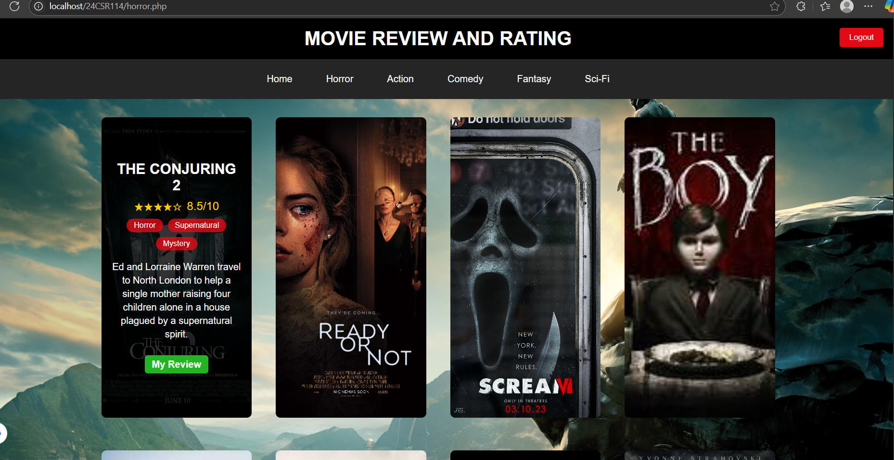

# Movie Review and Rating Website

A comprehensive movie review and rating platform built with PHP, MySQL, HTML, CSS, and JavaScript. Users can browse movies by categories, submit reviews, and rate movies.

## 🎬 Features

### User Authentication

- **Login System**: Secure user authentication
- **Registration**: New user sign-up functionality
- **Session Management**: Persistent login sessions

### Movie Categories

- **Horror Movies**: Dedicated section for horror films
- **Action Movies**: Action-packed movie collection
- **Comedy Movies**: Comedy films section
- **Science Fiction**: Sci-fi movie category
- **Fantasy Movies**: Fantasy genre collection

### Interactive Features

- **Movie Carousel**: Bootstrap-powered homepage carousel with movie trailers
- **Hover Effects**: Movie posters show ratings and brief story overview on hover
- **Review System**: Users can submit and view movie reviews
- **Rating System**: Rate movies out of 10
- **Responsive Design**: Mobile-friendly interface

### Background Audio

- Immersive background audio experience
- Audio controls for user preference

## 🛠️ Technologies Used

- **Frontend**: HTML5, CSS3, JavaScript, Bootstrap
- **Backend**: PHP
- **Database**: MySQL (via XAMPP)
- **Form Validation**: JavaScript
- **Server**: Apache (XAMPP)

## 📋 Prerequisites

Before installing, ensure you have:

- XAMPP (Apache + MySQL + PHP)
- Web browser (Chrome, Firefox, Safari, etc.)
- Text editor (optional, for modifications)
  ### Homepage (`index.php`


## 🚀 Installation Guide

### Step 1: Download and Install XAMPP

1. Download XAMPP from [https://www.apachefriends.org/](https://www.apachefriends.org/)
2. Install XAMPP on your system
3. Start Apache and MySQL services from XAMPP Control Panel


### Step 2: Set Up Project Files

1. Download/Clone this project
2. Extract the project folder to `C:\xampp\htdocs\` (Windows) or `/Applications/XAMPP/htdocs/` (Mac)
3. Rename the folder to `movie_reviews` (or your preferred name)

### Step 3: Database Setup

1. Open your web browser
2. Navigate to `http://localhost/phpmyadmin`
3. Click on "New" to create a new database
4. Name the database `movie_reviews`
5. Click "Create"


### Step 4: Import SQL File

1. Select your newly created database (`movie_reviews`)
2. Click on the "Import" tab
3. Click "Choose File" and select the provided `databaselogin.sql` and `new.sql`file
4. Click "Go" to import the database structure and data

### Step 5: Configure Database Connection

1. Open the project folder
2. Update database credentials if needed:

```php
$servername = "localhost";
$username = "root";
$password = "";
$dbname = "movie_reviews";
```

### Step 6: Run the Website

1. Ensure XAMPP Apache and MySQL are running
2. Open web browser
3. Navigate to `http://localhost/movie_reviews/`
4. You should see the homepage with the movie carousel

## 📱 Website Pages

### Homepage (`index.php`)

- Welcome message and movie carousel
- Featured movie trailers
- Navigation to different categories
- Quick statistics about movie counts


### Login Page (`login.php`)

- User authentication form
- Form validation with JavaScript
- Redirect to homepage after successful login
- Link to registration page


### Registration Page (`signup.php`)

- New user registration form
- Input validation
- Secure password handling
- Automatic redirect to login after registration

### Category Pages

- **Horror** (`horror.php`): Horror movie collection
- **Action** (`action.php`): Action movie listings
- **Comedy** (`comedy.php`): Comedy films
- **Sci-Fi** (`scifi.php`): Science fiction movies
- **Fantasy** (`fantasy.php`): Fantasy genre movies



### Public Reviews Page

- All public movie reviews
- User ratings and comments
- Sorted by most recent


## 🎨 Design Features

### Movie Hover Effects

Each movie poster includes:

- **Rating Display**: Shows current user rating
- **Story Overview**: Brief 2-line movie description
- **Review Button**: Direct link to review page
- **Smooth Animations**: CSS transitions for better UX

### Responsive Layout

- Mobile-friendly design
- Bootstrap grid system
- Adaptive navigation menu
- Optimized for all screen sizes

## 🔧 Configuration

### Database Configuration

Update `config.php` with your database details:

```php
<?php
$host = 'localhost';
$dbname = 'movie_review_db';
$username = 'root';
$password = '';

try {
    $pdo = new PDO("mysql:host=$host;dbname=$dbname", $username, $password);
    $pdo->setAttribute(PDO::ATTR_ERRMODE, PDO::ERRMODE_EXCEPTION);
} catch(PDOException $e) {
    echo "Connection failed: " . $e->getMessage();
}
?>
```

### Audio Settings

To enable/disable background audio, modify the audio controls in your HTML:

```html
<audio autoplay loop>
  <source src="ReelAudio-86229.mp3" type="audio/mpeg" />
</audio>
```

## 🎯 Usage Instructions

### For Users

1. **Registration**: Create a new account using the sign-up form
2. **Login**: Access your account with username/password
3. **Browse Movies**: Navigate through different categories
4. **View Details**: Hover over movie posters for quick info
5. **Submit Reviews**: Click review buttons to rate and review movies
6. **Read Reviews**: Check out what other users think about movies

### For Administrators

1. **Add Movies**: Use the admin panel to add new movies
2. **Manage Categories**: Create or modify movie categories
3. **Moderate Reviews**: Review and approve user submissions
4. **Update Content**: Modify movie information and descriptions

## 🐛 Troubleshooting

### Common Issues

**Database Connection Error**

- Ensure XAMPP MySQL is running
- Check database credentials in `config.php`
- Verify database name matches imported SQL

**Images Not Loading**

- Check file paths in image src attributes
- Ensure images are in the correct directory
- Verify file permissions

**Login Issues**

- Clear browser cache and cookies
- Check if sessions are enabled in PHP
- Verify database table structure

**Audio Not Playing**

- Check browser audio permissions
- Ensure audio files are in correct format
- Verify file paths in HTML

## 🔒 Security Features

- **SQL Injection Protection**: Prepared statements used
- **Password Hashing**: Secure password storage
- **Session Security**: Proper session management
- **Input Validation**: Client and server-side validation
- **XSS Protection**: Output sanitization

## 🚧 Future Enhancements

- Advanced search functionality
- Movie recommendations system
- Social sharing features
- Mobile app development
- API integration for movie data
- Admin dashboard improvements

## 📞 Support

For technical support or questions:

1. Check the troubleshooting section above
2. Review the installation steps
3. Ensure all prerequisites are met
4. Contact the development team

## 📄 License

This project is licensed under the MIT License - see the LICENSE file for details.

## 🤝 Contributing

1. Fork the repository
2. Create your feature branch
3. Commit your changes
4. Push to the branch
5. Create a Pull Request

---

**Happy Movie Reviewing! 🎬✨**
